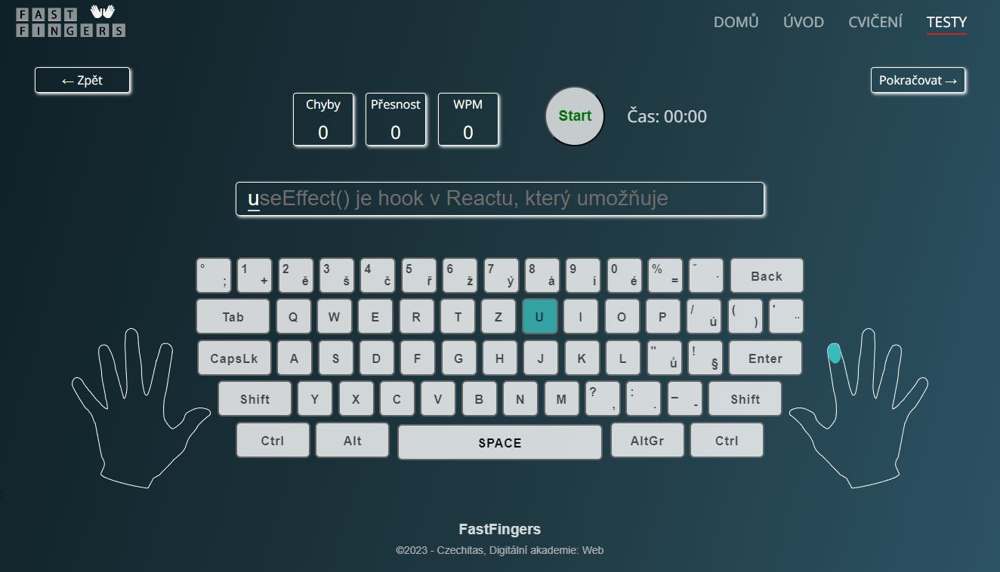
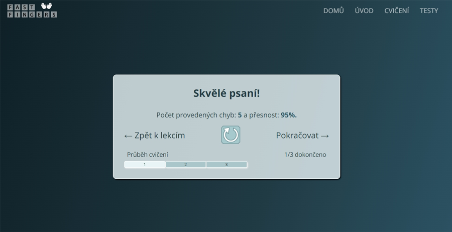
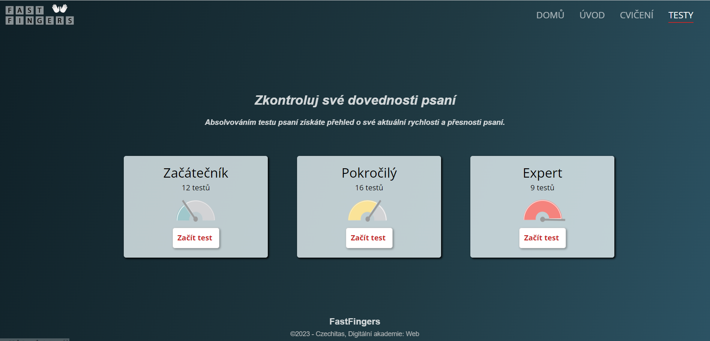

**FastFingers** is an interactive application designed to help users practice and improve their typing speed and accuracy on the keyboard. By providing a range of exercises, tests, and performance evaluation features, FastFingers aims to enhance users' typing skills and productivity, making keyboard usage a seamless part of their daily routine.

## Features
#### 1. Exercises 
A variety of exercises that cover entering lower/uppercase letters, numbers and symbols.
#### 2. Tests 
- The tests measure typing speed, accuracy, errors, and words per minute (WPM). 
- The tests focus on programming-oriented skills, including definitions, providing users with an opportunity to not only assess their typing progress but also learn basic programming concepts.

## Key Features
#### 1. Interactive Interface
User-friendly interface with intuitive controls, ensuring a comfortable and enjoyable user experience.

#### 2. Performance Evaluation
After completing an exercise or test, users receive a comprehensive evaluation of their performance, including the **number of errors**, **accuracy** and **WPM (Word Per Minutes)**.

#### 3. Customizable Exercises
Users have the flexibility to customize exercises according to their preferences, adjusting the difficulty level to match their skill level.

## Technologies

- [React](https://react.dev/)
- [Node.js](https://nodejs.org/en/download/)
- [npm](https://www.npmjs.com/)
- [Git](https://git-scm.com/)
- [BEM](https://getbem.com/)
- [Photoshop](https://www.adobe.com/products/photoshop.html?promoid=RBS7NL7F&mv=other)
- [Figma](https://www.figma.com/files/recent?fuid=1118150087554297669)
- [Trello](https://trello.com/u/icx944/boards)

## Installation
1. Clone this repository to your local device.
2. Navigate to the project folder in your terminal.
3. Run the command `npm install` to install the required dependencies.
4. Run the command `npm start` to launch the FastFingers application.

## Feedback
We value your feedback! If you have any ideas for improvements or encounter any issues while using the FastFingers application, please feel free to provide your feedback and suggestions.

## Authors
The **FastFingers** application is the result of a collaborative effort by a team of passionate frontend web juniors [Nataliia Hladii](https://github.com/NataliiaHl) and [Inna Červenková](https://github.com/ICerv) who share a love for typing and a common goal of helping others improve their typing skills.

Throughout the entire development process, our dedicated mentors, **Martin Havel** and **Lam Tran**, provided us with invaluable support and guidance, demonstrating their exceptional mentoring skills. We would also like to express our gratitude to [Czechitas  organization](https://www.czechitas.cz/) for making this project possible, as well as all the lecturers and coaches, for their invaluable knowledge and experience they have shared with us. We are excited to continue expanding our skills and expertise in front-end development.
